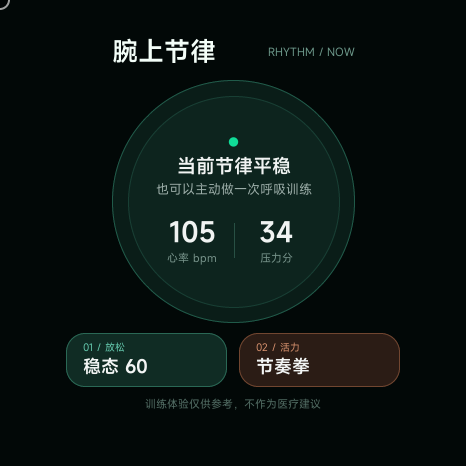

# 腕上节律（Wrist Rhythm）



## 一、作品简介

腕上节律是一款面向 openvela 圆形手表的身心训练快应用。它把健康数据与腕部动作转换为两种短时训练：

- **稳态 60**：根据心率、压力及变化趋势，提供 60 秒 4-2-4 或 4-2-6 呼吸训练，并展示训练前后变化。
- **节奏拳**：通过加速度计识别腕部出拳动作，完成 30 秒节拍挑战；心率升高时会自动降低节拍速度。

应用针对 480×480 圆形表盘和短视口设计，健康数据或加速度计不可用时仍可分别降级为离线呼吸训练和点击模拟模式。本作品仅用于放松训练，不用于疾病诊断或治疗。

## 二、选题方向

**快应用 / 手表应用创新**。

作品利用 openvela 快应用的健康数据与传感器能力，把被动显示健康指标扩展为可立即参与、可反馈结果的腕上训练体验。

## 三、作品亮点

- 实时读取和订阅心率、压力，结合高值与上升趋势给出训练提示。
- 在完整呼吸周期边界依据训练效果自适应调整呼吸节奏。
- 基于真实经过时间的训练时钟，支持前后台暂停、资源释放与安全恢复。
- 加速度突变识别、动作防抖、三级节拍评分、连击与心率自适应节奏。
- 健康接口和传感器异常均有明确降级路径。
- B1 棱镜夜光毛玻璃视觉体系，并针对圆屏安全区、紧凑尺寸和短视口适配。
- 67 项自动化测试覆盖训练算法、运行时生命周期、组件契约与发布构建编排。

## 四、目录结构

```text
quickapp/wrist-rhythm/
├── src/                  # 快应用源码、页面、组件和系统能力适配
├── test/                 # 逻辑、生命周期、组件契约和发布测试
├── scripts/              # 发布构建与图标优化工具
├── docs/                 # 设计、实施记录和作品预览
├── package.json          # Node.js 依赖和构建命令
└── README.md             # 完整功能、接口及模拟器验收说明
logs/                     # AI Coding 日志及提交格式说明
artifacts/                # 可供评审安装的调试签名 RPK
contest2026_467_chibubaoduibudui.xml
                          # repo manifest 与快应用映射
```

manifest 会把 `quickapp/wrist-rhythm/` 映射到 openvela 工作树中的：

```text
packages/apps/contest2026_467_wrist_rhythm
```

## 五、运行方式

### 1. 拉取完整 openvela 工程

```bash
repo init -u https://github.com/open-vela/contest2026_467_chibubaoduibudui \
  -b dev-ai-contest-2026 -m contest2026_467_chibubaoduibudui.xml
repo sync -c -j8
```

### 2. 安装依赖并验证

需要 Node.js 22 或更高版本，以及 AIoT IDE、`aiot-core` 和 `aiot-emulator` 1.7.22 或更高版本。

```bash
cd contest2026_467_chibubaoduibudui/quickapp/wrist-rhythm
npm ci
npm test
npm run build
```

调试构建产物：

```text
dist/com.openvela.wristrhythm.debug.1.0.0.rpk
```

仓库同时提交了 `artifacts/com.openvela.wristrhythm.debug.1.0.0.rpk` 供评审安装。正式发布包需配置由发布方管理的签名证书后运行 `npm run build:release`；仓库不包含私钥或分发凭据。

### 3. 模拟器运行

1. 使用 AIoT IDE 打开 `quickapp/wrist-rhythm/`。
2. 新建并启动 `vela-miwear-watch-5.0(开发者大赛)` 模拟器。
3. 编译并推送应用。
4. 按[应用详细说明](quickapp/wrist-rhythm/README.md#模拟器验收)完成健康数据、呼吸训练、节奏拳、降级模式和圆屏布局验收。

## 六、AI Coding 使用说明

本作品在需求拆解、架构设计、测试驱动开发、设备兼容性排查、圆屏界面迭代和发布流程加固中使用了 AI Coding：

- 先把健康订阅、训练时钟、运动识别和页面生命周期拆成可独立验证的模块。
- 用自动化测试固定边界行为，再实现或调整功能，降低设备 API 与异步生命周期带来的回归风险。
- 通过设计文档和实施计划记录圆屏视觉、安全区、动画兼容性与异常降级决策。
- 对发布流程增加可注入工具链测试，防止旧产物被误当成新发布包。

设计与实施记录位于 `quickapp/wrist-rhythm/docs/superpowers/`；由大赛采集器导出的完整对话日志应位于 `logs/<github_login>/`。

## 七、更多说明

完整功能清单、接口兼容性、构建细节和逐项模拟器验收步骤见 [quickapp/wrist-rhythm/README.md](quickapp/wrist-rhythm/README.md)。
